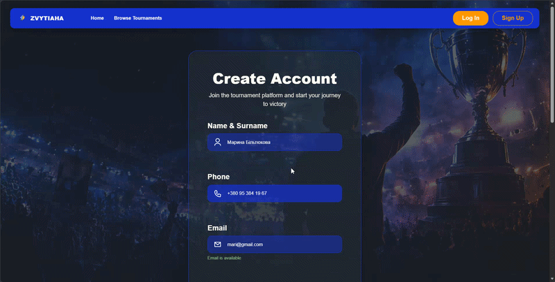
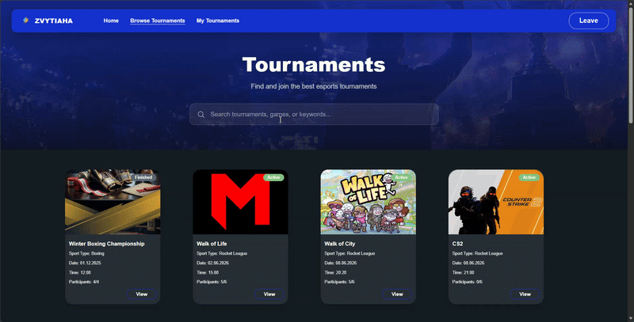
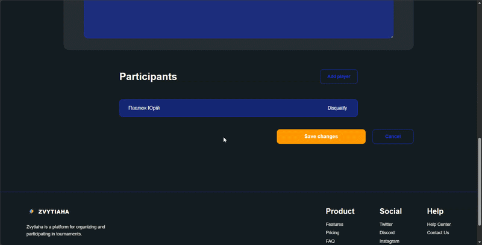

<div align="center">
  
</div>

# Tournament-Platform-System

<div align="center">


</div>

Система управління турнірами, яка дозволяє користувачам створювати турніри, керувати учасниками та відстежувати результати матчів

## 👥 Команда проєкту
* **Анур'єва Катерина** — Project Manager
* **Скуртул Сергій** — Backend Developer
* **Дудко Володимир** — Database Engineer
* **Ярмолюк Людмила** — Frontend Developer
* **Загрбенюк Богдан** — QA Engineer

## Корисні посилання
* **[Project Hub (Wiki)](https://github.com/katushhiaa/Tournament-Platform-System/wiki)** — повна документація проєкту.
* **[Jira Board](https://tournamentsystem.atlassian.net/jira/software/projects/DEV/boards/1/backlog)** — таск-трекер та керування спринтами.
* **[Figma Design]()** — прототипи інтерфейсу користувача.
* **[Swagger API](http://localhost:5050/swagger)** — інтерактивна API-документація (доступна локально після запуску стеку через `docker compose up`).

## Структура репозиторію
Згідно з обраною архітектурою, проєкт має наступну структуру папок:

* `📂 /docs` — Документація, ТЗ, діаграми, API-специфікації
* `📂 /client` — Frontend-частина застосунку.
* `📂 /server` — Backend-частина застосунку.
* `📂 /shared` — Спільні ресурси (типи даних, константи, переклади).
* `📂 /deploy` — Конфігурації для Docker, CI/CD, скрипти розгортання.

## Технологічний стек
* **Backend:** ASP.NET Core (.NET 9)
* **Frontend:** Vue 3 + TypeScript (Vite)
* **Database:** PostgreSQL 15
* **Інфраструктура:** Docker / Docker Compose

## 🚀 Інструкція з розгортання (Deployment Guide)

Проєкт повністю контейнеризований — для запуску достатньо Docker. Жодних локально встановлених .NET, Node чи PostgreSQL не потрібно.

### Системні вимоги

| Компонент | Мінімум | Протестовано на |
|-----------|---------|-----------------|
| Docker Engine | 20.10+ | 28.5.1 |
| Docker Compose | v2.0+ | v2.40.3 |
| RAM (виділено Docker) | 4 GB | 8 GB |
| CPU | 2 ядра | 4 ядра |
| Вільне місце на диску | ~3 GB | — |
| ОС | Windows 10/11, macOS, Linux | Windows 11 Pro |

> Достатньо встановленого **Docker Desktop** (включає Engine + Compose).

### Кроки запуску

```bash
# 1. Клонувати репозиторій
git clone https://github.com/katushhiaa/Tournament-Platform-System
cd Tournament-Platform-System

# 2. Створити файл змінних оточення з шаблону
cp .env.example .env        # Windows (cmd): copy .env.example .env
#   за потреби відредагувати паролі та JWT__KEY у .env

# 3. Підняти весь стек (db, backend, frontend, pgAdmin)
docker compose up --build
```

Перший запуск збирає образи та виконує міграції + наповнення БД автоматично (контейнер `init`) — це може зайняти кілька хвилин.

### Доступ до сервісів

| Сервіс | URL |
|--------|-----|
| Frontend (застосунок) | http://localhost:5173 |
| Backend API | http://localhost:5050/api/v1 |
| Swagger (API-документація) | http://localhost:5050/swagger |
| pgAdmin (керування БД) | http://localhost:8080 |

### Корисні команди

```bash
docker compose down          # зупинити стек
docker compose down -v       # зупинити + очистити БД (чистий перезапуск)
docker compose up --build    # перезібрати й підняти заново
```

> ⚠️ Перед перемиканням між гілками робіть `docker compose down -v`, щоб уникнути конфлікту міграцій.

## 🔑 Тестові доступи (Credentials)

- **Основний спосіб** — зареєструвати власний акаунт через кнопку **Sign Up** на `http://localhost:5173/register` (доступні ролі Organizer та Player).
- **Seed-користувачі** — при першому запуску БД наповнюється тестовими користувачами з `server/seeds/seed.sql`:
  - Організатори: `john.smith@example.com`, `jane.williams@example.com`
  - Гравці: `alex.johnson@example.com`, `michael.brown@example.com` та ін.
  - Пароль seed-користувачів зберігається у вигляді хешу; актуальний plaintext-пароль уточнюйте у Backend-розробника (Сергій Скуртул).

## 📂 Структура проєкту (де що знаходиться)

| Розташування | Призначення |
|--------------|-------------|
| `/client` | **Frontend** — Vue 3 + TypeScript (Vite) |
| `/server` | **Backend** — ASP.NET Core (.NET 9) |
| `/server/.../Infrastructure/Migrations` | **Міграції БД** (Entity Framework Core) |
| `/server/seeds/seed.sql` | Початкові тестові дані (seed) |
| `docker-compose.yml` | Оркестрація всіх сервісів |
| `.env.example` | Шаблон змінних оточення |

## 📁 Структура клієнтської частини
client/src/
├── api/              # Axios-інстанція, базові налаштування HTTP-запитів

├── assets/           # Статичні ресурси (зображення, шрифти)

│   └── icons/        # SVG-іконки

├── components/       # Перевикористовувані Vue-компоненти

│   ├── dashboard/    # Компоненти дашборду (картки турнірів, секції)

│   ├── forms/        # Форми (логін, реєстрація, створення турніру)

│   ├── modals/       # Модальні вікна

│   ├── tournament/   # Компоненти сторінки турніру (деталі, учасники, сітка)

│   └── ui/           # Базові UI-елементи (кнопки, інпути, спінери)

├── hooks/            # Композабли (useAuth, useTournament тощо)

├── router/           # Vue Router — визначення маршрутів

├── services/         # Сервіси для роботи з API (authService, tournamentService)

├── stores/           # Pinia-стори — глобальний стан застосунку

├── types/            # TypeScript-типи та інтерфейси

├── utils/            # Утиліти (форматування дат, валідація тощо)

└── views/            # Сторінки застосунку (HomePage, LoginPage тощо)


---
## 📸 Screenshots

### 🏠 Головна сторінка


Лендінг з hero-секцією, переліком активних турнірів та описом платформи для організаторів і гравців.

---

### 🔐 Авторизація

| Вхід | Реєстрація |
|------|------------|
|  |  |

---

### 🎮 Гравець

**Дашборд** — персоналізований огляд активних та приєднаних турнірів.


**Перегляд турнірів** — повний список з пошуком і пагінацією.


**Мої турніри** — турніри, до яких гравець приєднався.


**Деталі турніру** — огляд, умови, учасники, сітка гравців.

| Подати заявку | Скасувати участь |
|---------------|-----------------|
|  |  |

---

### 🛠️ Організатор

**Дашборд** — огляд створених турнірів, розділених на активні та керовані.


**Мої турніри** — повний список створених турнірів з пошуком.


**Деталі турніру** — вигляд організатора з кнопкою редагування.


**Створення турніру** — форма з завантаженням банера, типом спорту, датами, описом та умовами.


**Редагування турніру** — попередньо заповнена форма з керуванням учасниками та можливістю дискваліфікації.


---

## 🎬 Demo
### Реєстрація


### Пошук турнірів


### Взяти участь


### Скасувати участь


### Генерація сітки


### Результати матчу


### Дискваліфікація


### Додати гравця 


## 📱 Mobile View
### Головна
%20(1).png)

### Дашборд гравця 
.png)

### Дашборд організатора 
.png)

*Чернівці, 2026*
