<div align="center">
  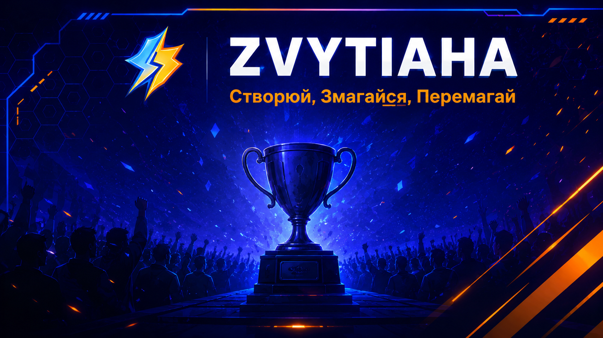
</div>

<div align="center">


</div>


# ZVYTIAHA

Система управління турнірами, яка дозволяє користувачам створювати турніри, керувати учасниками та відстежувати результати матчів

## ✨ Features

- 🏆 Швидке створення турніру — запустіть змагання за кілька хвилин 
через зручну форму з банером, типом спорту та умовами участі

- 🔍 Розумний пошук — знаходьте потрібні турніри за назвою завдяки системі фільтрів та пагінації

- 👥 Керування учасниками — організатор може додавати гравців, 
дискваліфіковувати та відстежувати склад у реальному часі

- 🎯 Автоматична турнірна сітка — система сама розподіляє гравців 
після набору учасників, без жодної ручної роботи

- 📊 Фіксація результатів матчів — вносьте рахунки одразу після гри, 
прогрес турніру оновлюється миттєво

- 🔐 Безпечний доступ — окремі ролі для Гравця та Організатора 
захищені сучасною JWT-авторизацією

- 📱 Адаптивний дизайн — платформа однаково зручна на комп'ютері
та смартфоні

## 👥 Команда проєкту
* **Анур'єва Катерина** — Project Manager
* **Скуртул Сергій** — Backend Developer
* **Дудко Володимир** — Database Engineer
* **Ярмолюк Людмила** — Frontend Developer
* **Загрбенюк Богдан** — QA Engineer

## 🔗 Корисні посилання
* **[Project Hub (Wiki)](https://github.com/katushhiaa/Tournament-Platform-System/wiki)** — повна документація проєкту.
* **[Jira Board](https://tournamentsystem.atlassian.net/jira/software/projects/DEV/boards/1/backlog)** — таск-трекер та керування спринтами.
* **[Figma Design](https://www.figma.com/design/3vOrfAqN7YR6snGJBVQURt/UI-%D0%BF%D1%80%D0%BE%D1%82%D0%BE%D1%82%D0%B8%D0%BF?node-id=0-1&t=ApE2quWKRSBYVRjD-1)** — прототипи інтерфейсу користувача.
* **[Swagger API](http://localhost:5050/swagger)** — інтерактивна API-документація (доступна локально після запуску стеку через `docker compose up`).


## 🚀 Інструкція з розгортання (Setup Guide)

Проєкт повністю контейнеризований — для запуску достатньо Docker. Жодних локально встановлених .NET, Node чи PostgreSQL не потрібно.

### Системні вимоги

| Компонент | Мінімум | Протестовано на |
|-----------|---------|-----------------|
| Docker Engine | 20.10+ | 28.5.1 |
| Docker Compose | v2.0+ | v2.40.3 |
| RAM (виділено Docker) | 4 GB | 8 GB |
| CPU | 2 ядра | 4 ядра |
| Вільне місце на диску | ~3 GB | — |
| ОС | Windows 10/11, macOS, Linux | Windows 11 Pro |

> Достатньо встановленого **Docker Desktop** (включає Engine + Compose).

### Кроки запуску

```bash
# 1. Клонувати репозиторій
git clone https://github.com/katushhiaa/Tournament-Platform-System
cd Tournament-Platform-System

# 2. Створити файл змінних оточення з шаблону
cp .env.example .env        # Windows (cmd): copy .env.example .env
#   за потреби відредагувати паролі та JWT__KEY у .env

# 3. Підняти весь стек (db, backend, frontend, pgAdmin)
docker compose up --build
```

Перший запуск збирає образи та виконує міграції + наповнення БД автоматично (контейнер `init`) — це може зайняти кілька хвилин.

### Доступ до сервісів

| Сервіс | URL |
|--------|-----|
| Frontend (застосунок) | http://localhost:5173 |
| Backend API | http://localhost:5050/api/v1 |
| Swagger (API-документація) | http://localhost:5050/swagger |
| pgAdmin (керування БД) | http://localhost:8080 |

### Корисні команди

```bash
docker compose down          # зупинити стек
docker compose down -v       # зупинити + очистити БД (чистий перезапуск)
docker compose up --build    # перезібрати й підняти заново
```

> ⚠️ Перед перемиканням між гілками робіть `docker compose down -v`, щоб уникнути конфлікту міграцій.

## 🔑 Тестові доступи (Credentials)

- **Основний спосіб** — зареєструвати власний акаунт через кнопку **Sign Up** на `http://localhost:5173/register` (доступні ролі Organizer та Player).
- **Seed-користувачі** — при першому запуску БД наповнюється тестовими користувачами з `server/seeds/seed.sql`:
  - Організатори: `john.smith@example.com`, `jane.williams@example.com`
  - Гравці: `alex.johnson@example.com`, `michael.brown@example.com` та ін.
  - Пароль seed-користувачів зберігається у вигляді хешу; актуальний plaintext-пароль уточнюйте у Backend-розробника (Сергій Скуртул).

## 📂 Структура проєкту (де що знаходиться)

| Розташування | Призначення |
|--------------|-------------|
| `/client` | **Frontend** — Vue 3 + TypeScript (Vite) |
| `/server` | **Backend** — ASP.NET Core (.NET 9) |
| `/server/.../Infrastructure/Migrations` | **Міграції БД** (Entity Framework Core) |
| `/server/seeds/seed.sql` | Початкові тестові дані (seed) |
| `docker-compose.yml` | Оркестрація всіх сервісів |
| `.env.example` | Шаблон змінних оточення |
| `tournament-platform-system-secrets.example.json` | Секрети для доступу до Google Storage

## 📢 Marketing Kit

Повний набір маркетингових матеріалів та стратегічних артефактів проєкту розміщено в директорії [`/marketing`](https://github.com/katushhiaa/Tournament-Platform-System/tree/main/docs/marketing). 

Нижче наведено огляд структури та вмісту активів, які використовуються для просування та позиціювання продукту.

### 📁 Структура матеріалів

| Розділ | Опис активів та файли |
| :--- | :--- |
| **🎨[Брендінг](https://github.com/katushhiaa/Tournament-Platform-System/tree/main/docs/marketing/branding)** | Елементи фірмового стилю для візуальної ідентифікації:<br>• `logo_primary.png` — основний логотип проекту.<br>• `logo_white.svg` — векторний логотип для темних фонів.<br>• `style_guide.pdf` — гайдлайн (HEX/RGB коди кольорів, шрифти, слоган). |
|    **🎬[Відеоматеріали](https://github.com/katushhiaa/Tournament-Platform-System/tree/main/docs/marketing/video)**    | Візуальний контент для презентації продукту:<br>• `product_promo_video.mp4` — промо-ролик тривалістю 45–60 секунд.<br>• `thumbnail.jpg` — приваблива обкладинка (прев'ю) для відео. |
| **✍️[Копірайтинг](https://github.com/katushhiaa/Tournament-Platform-System/tree/main/docs/marketing/copywriting)** | Текстові матеріали для пітчингу:<br>• `elevator_pitch.txt` — текстова версія 60-секундної презентації проєкту. |
| **📊[Стратегія](https://github.com/katushhiaa/Tournament-Platform-System/tree/main/docs/marketing/strategy)** | Аналітичні та планові документи:<br>• `market_analysis.pdf` — SWOT-аналіз, дослідження конкурентів, портрети персон (цільової аудиторії), модель монетизації та гіпотези CAC.<br>• `social_media_plan.xlsx` — контент-календар, приклади публікацій та перелік каналів просування. |

---

> 💡 **Примітка:** Усі графічні та текстові матеріали є інтелектуальною власністю проєкту та оптимізовані для використання у соціальних мережах, презентаціях для інвесторів (Pitch Decks) та рекламних кампаніях.

## 📁 Структура клієнтської частини
client/src/
├── api/              # Axios-інстанція, базові налаштування HTTP-запитів

├── assets/           # Статичні ресурси (зображення, шрифти)

│   └── icons/        # SVG-іконки

├── components/       # Перевикористовувані Vue-компоненти

│   ├── dashboard/    # Компоненти дашборду (картки турнірів, секції)

│   ├── forms/        # Форми (логін, реєстрація, створення турніру)

│   ├── modals/       # Модальні вікна

│   ├── tournament/   # Компоненти сторінки турніру (деталі, учасники, сітка)

│   └── ui/           # Базові UI-елементи (кнопки, інпути, спінери)

├── hooks/            # Композабли (useAuth, useTournament тощо)

├── router/           # Vue Router — визначення маршрутів

├── services/         # Сервіси для роботи з API (authService, tournamentService)

├── stores/           # Pinia-стори — глобальний стан застосунку

├── types/            # TypeScript-типи та інтерфейси

├── utils/            # Утиліти (форматування дат, валідація тощо)

└── views/            # Сторінки застосунку (HomePage, LoginPage тощо)


---
## 📸 Screenshots

### 🏠 Головна сторінка

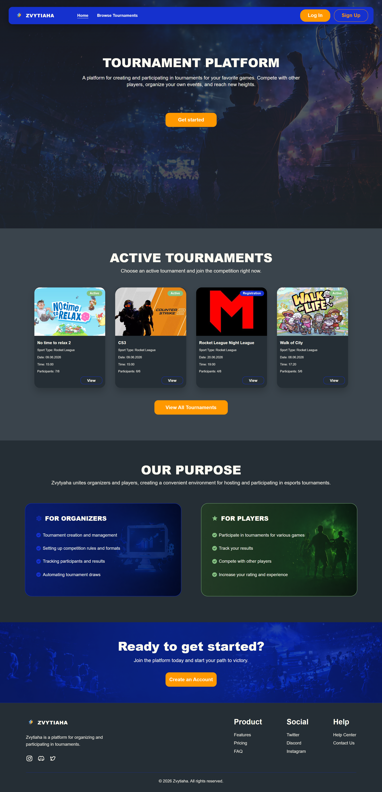

Лендінг з hero-секцією, переліком активних турнірів та описом платформи для організаторів і гравців.

---

### 🔐 Авторизація

| Вхід | Реєстрація |
|------|------------|
| 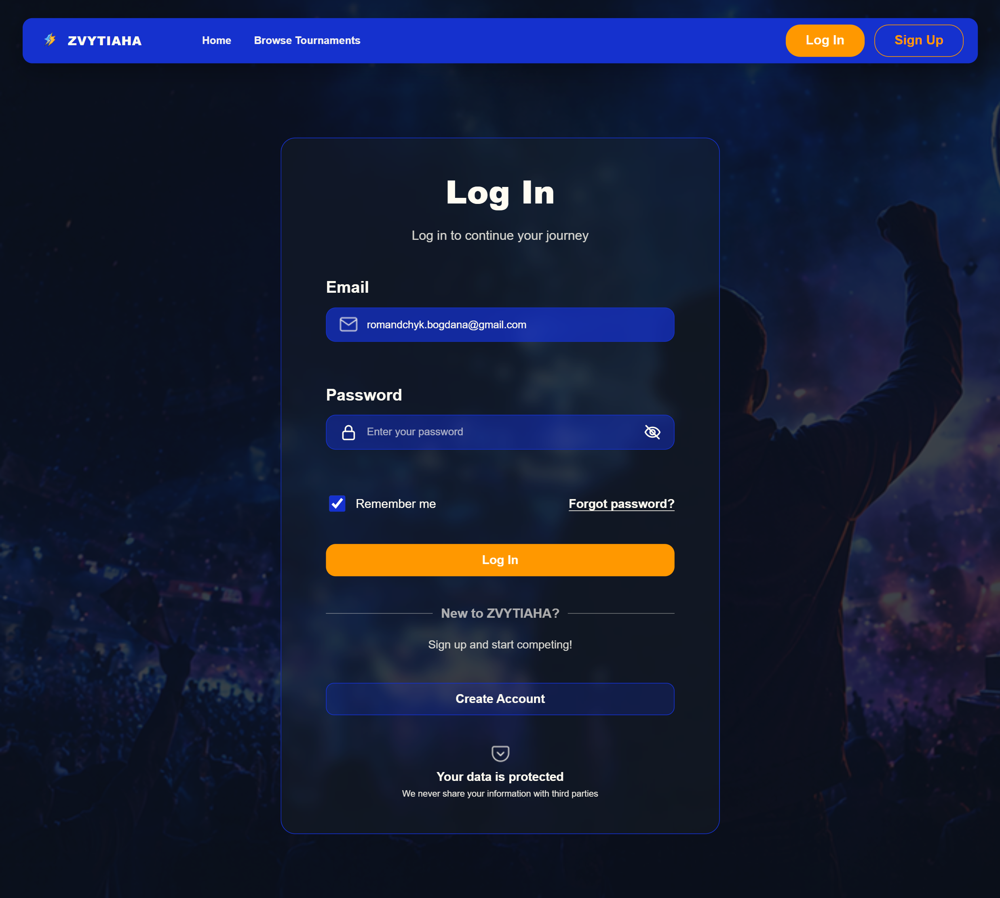 | 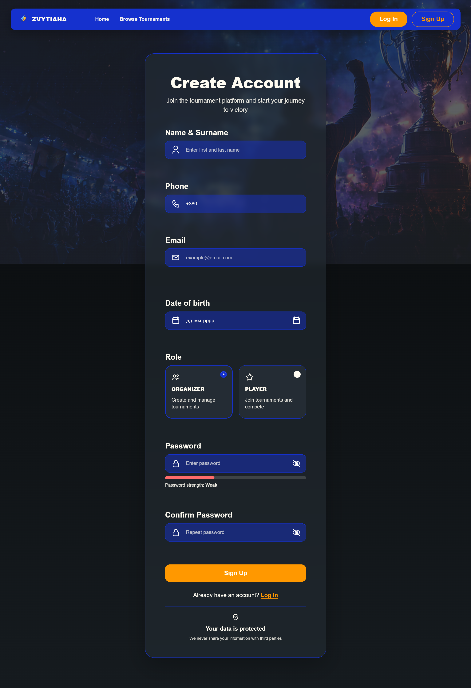 |

---

### 🎮 Гравець

**Дашборд** — персоналізований огляд активних та приєднаних турнірів.

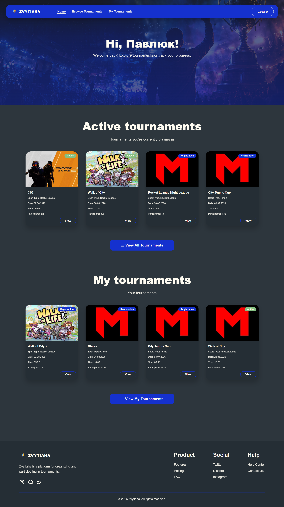

**Перегляд турнірів** — повний список з пошуком і пагінацією.

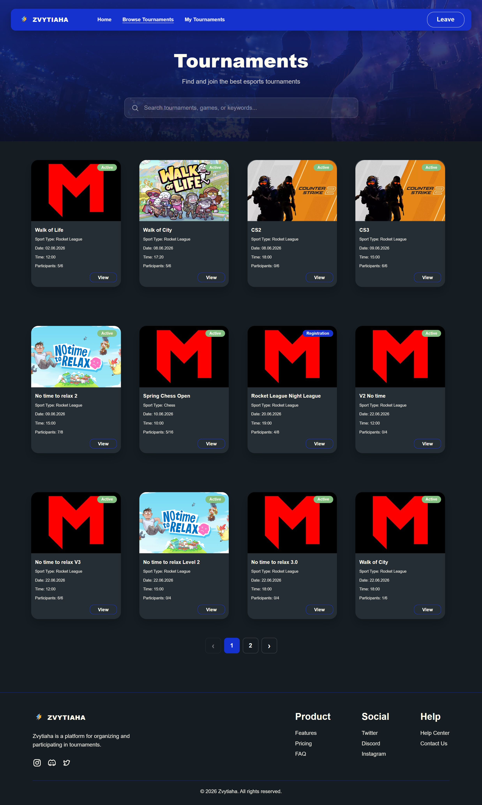

**Мої турніри** — турніри, до яких гравець приєднався.

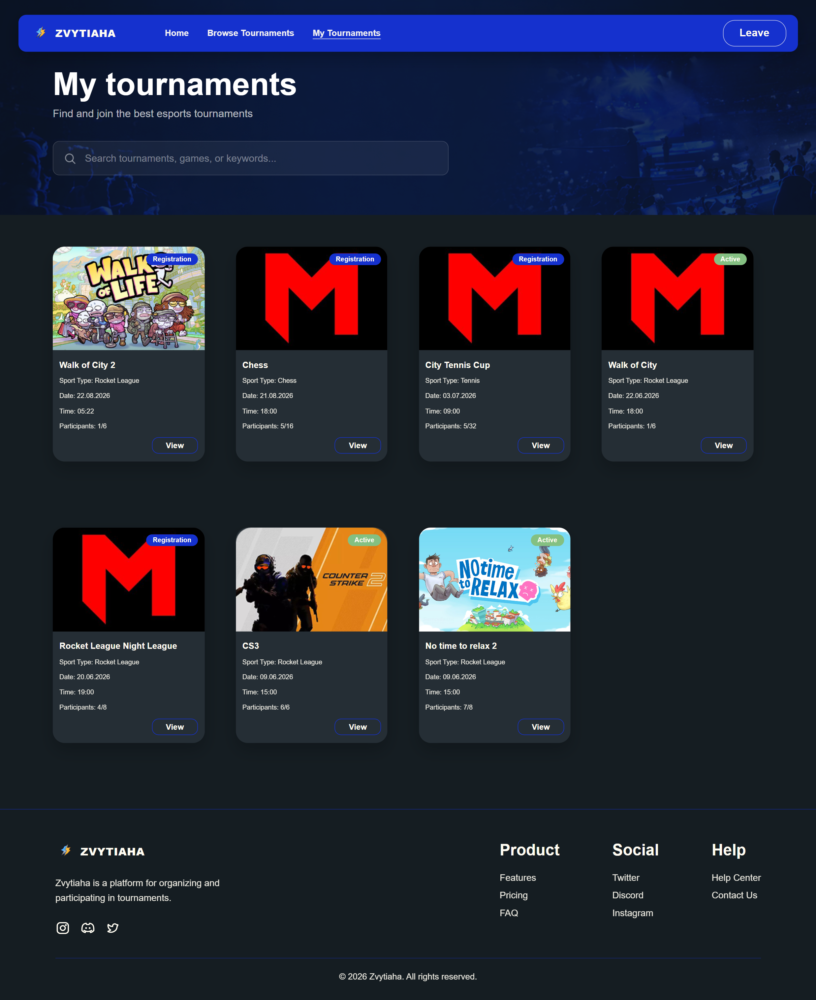

**Деталі турніру** — огляд, умови, учасники, сітка гравців.

| Подати заявку | Скасувати участь |
|---------------|-----------------|
| 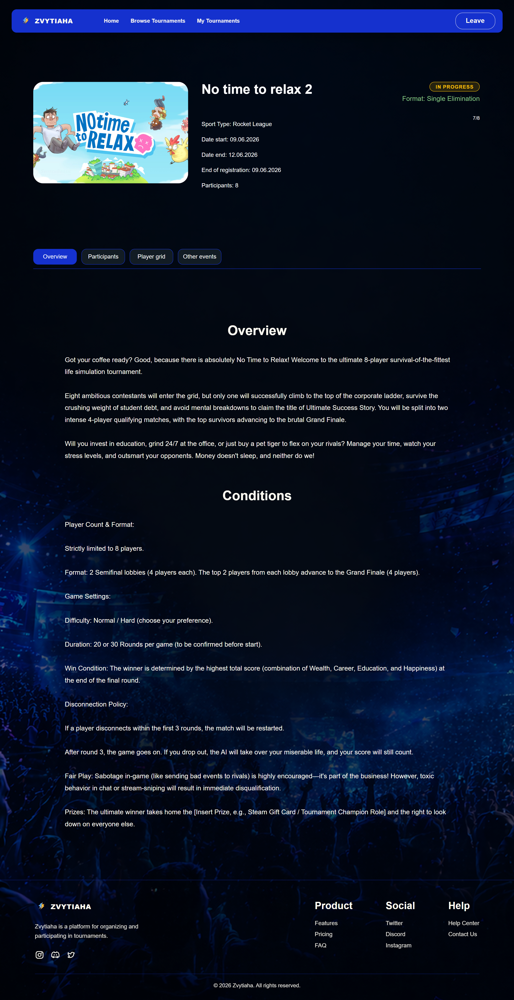 | 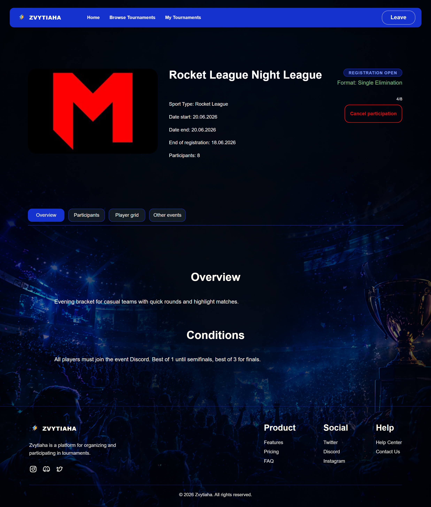 |

---

### 🛠️ Організатор

**Дашборд** — огляд створених турнірів, розділених на активні та керовані.

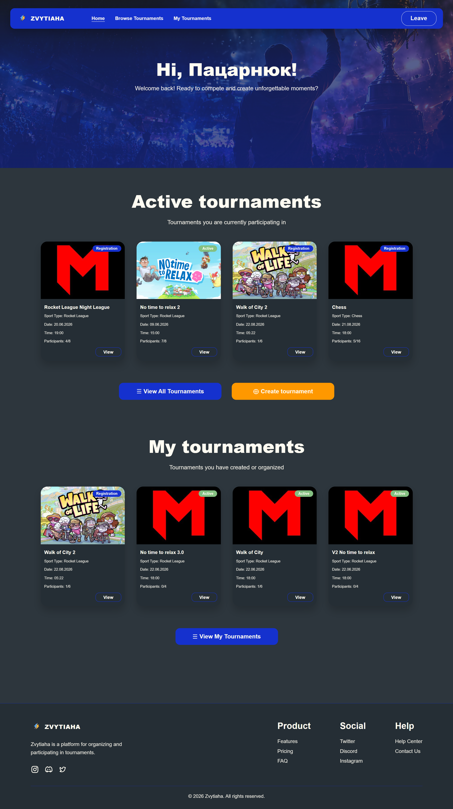

**Мої турніри** — повний список створених турнірів з пошуком.

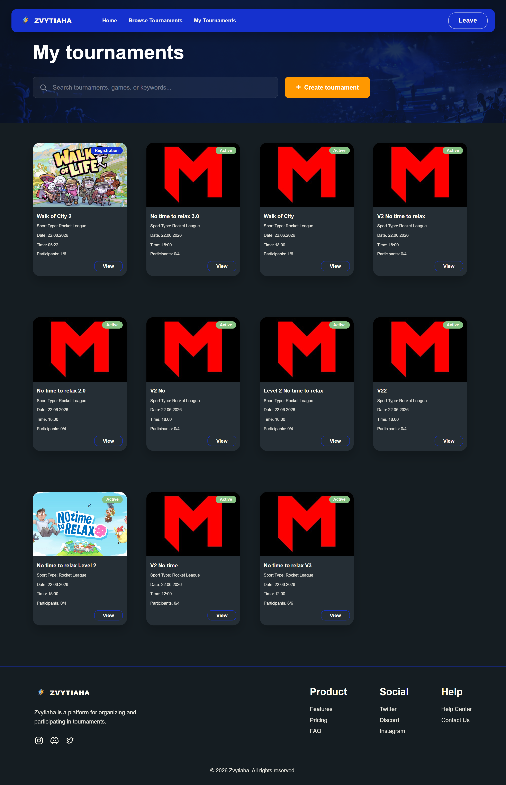

**Деталі турніру** — вигляд організатора з кнопкою редагування.

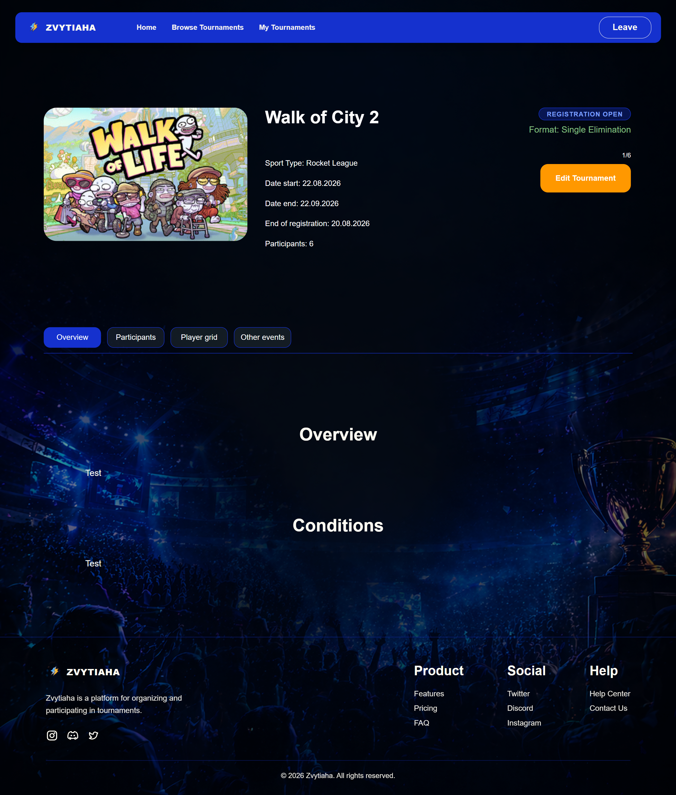

**Створення турніру** — форма з завантаженням банера, типом спорту, датами, описом та умовами.

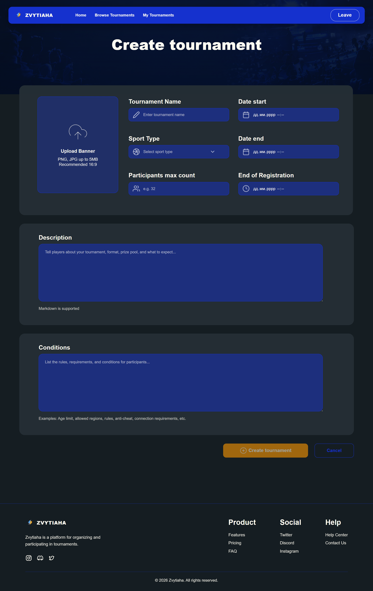

**Редагування турніру** — попередньо заповнена форма з керуванням учасниками та можливістю дискваліфікації.

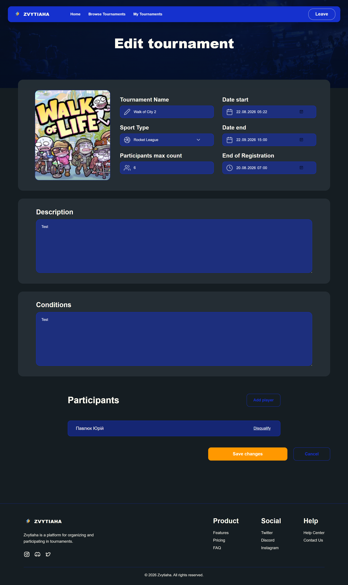
---

*Чернівці, 2026*
