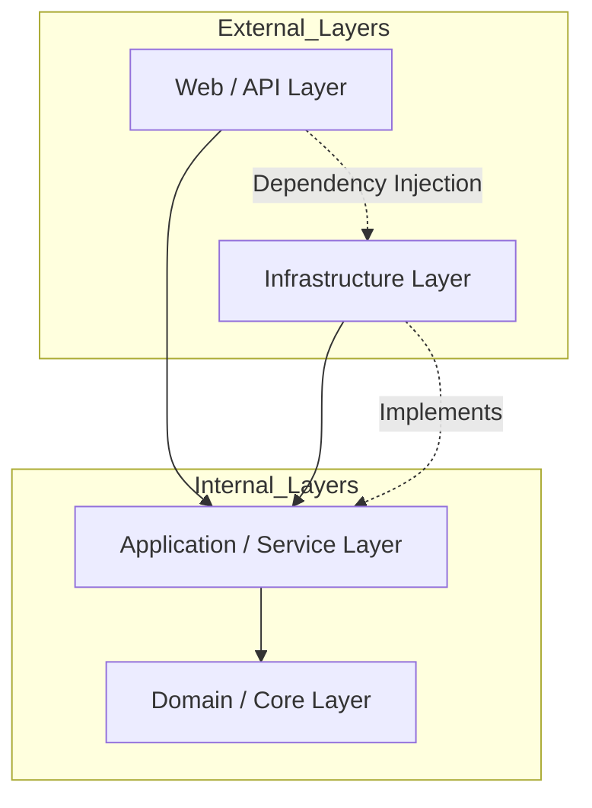

# Software Architecture Document: Internal View (SAD)

**Рівень архітектури:** Micro-level (Внутрішня структура коду)

## 1. Аналіз складності та вхідні дані (Input)

Перш ніж обрати паттерн, було проведено аналіз технічних та бізнес-вимог:

* **Складність бізнес-логіки:** Середня. Основна складність зосереджена в алгоритмах генерації турнірних сіток (Single Elimination), валідації результатів матчів та управлінні статусами турніру.
* **Стабільність стеку:** Використовується **ASP.NET Core** та **Entity Framework Core**. Зміна SQL бази даних на NoSQL у найближчій перспективі не планується, проте архітектура має дозволяти легку заміну інфраструктурних компонентів (напр. поштових сервісів).
* **Вимоги до тестування:** Згідно з DoD, покриття критичного бізнес-коду має бути $\ge 80\%$. Це вимагає високого рівня тестувальності (testability) та ізоляції логіки від зовнішніх залежностей.

## 2. Вибір архітектурного патерну

**Обраний патерн:** **Clean Architecture (Onion Architecture)**.

**Обґрунтування:**
Хоча *Layered Architecture* простіша у впровадженні, *Clean Architecture* є стандартом для сучасних .NET застосунків. Вона забезпечує інверсію залежностей, де ядро системи (Domain) не знає про існування бази даних або API. Це дозволяє команді тестувати логіку генерації сітки без підключення до реальної БД.

## 3. Layers Definition (Розподіл ролей)

| Шар (Layer) | Відповідальність | Приклади компонентів |
| :--- | :--- | :--- |
| **Web / API** | Прийом HTTP-запитів, серіалізація/десеріалізація JSON, обробка CORS, Swagger. | `TournamentsController`, `AuthMiddleware` |
| **Application** | Координація задач, мапінг DTO, виклик сервісів, валідація вхідних даних (FluentValidation). | `TournamentService`, `CreateTournamentCommand`, `ITournamentRepository` (interface) |
| **Domain (Core)** | Сутності БД, бізнес-правила, виключення (Exceptions), інтерфейси, що не залежать від технологій. | `Tournament` (entity), `BracketGenerator` (logic), `TournamentStatus` (enum) |
| **Infrastructure** | Реалізація доступу до даних, інтеграція з БД через EF Core, зовнішні API (Email, SMS). | `ApplicationDbContext`, `TournamentRepository`, `SmtpEmailSender` |

## 4. Візуалізація залежностей (UML Package Diagram)

Згідно з принципами Clean Architecture, залежності спрямовані **всередину** до Domain Layer.

## 5. Правила взаємодії та Dependency Injection

1.  **Напрямок залежностей:** `Web API` $\rightarrow$ `Application` $\rightarrow$ `Domain`. `Infrastructure` також залежить від `Application` (реалізуючи його інтерфейси).
2.  **Statelessness:** Сервіси в шарі Application не повинні зберігати стан між запитами.
3.  **Data Transfer:** Між API та Application передаються лише **DTO (Data Transfer Objects)**. Сутності Domain не виходять за межі Application Layer, щоб не "протікала" структура БД на клієнта.
4.  **DI Container:** Реєстрація всіх залежностей відбувається в проекті Web/API (Composition Root) за допомогою стандартного `IServiceCollection`.
